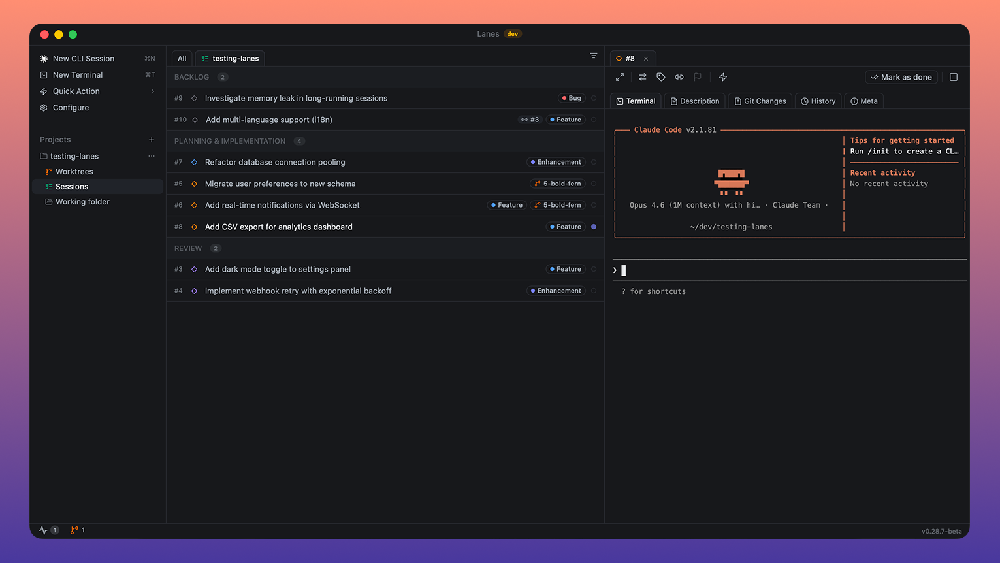

<!--  -->

<p align="center">
  <h1 align="center">Lanes</h1>
  <p align="center"><strong>Mission control for AI coding agents.</strong></p>
  <p align="center">Track, orchestrate, and ship across multiple AI CLI sessions from one place.</p>
  <p align="center"><a href="#install">Quick start</a></p>
</p>

<br>

<p align="center">
  
</p>

<br>

## You lost track three agents ago.

You have five AI coding agents running across eight terminal tabs. One is waiting for input. One finished ten minutes ago and you didn't notice. Two are doing overlapping work. The only thing keeping it all together is your short-term memory, and it just failed.

AI agents got powerful. The workflow around them didn't.

## Lanes fixes that.

Lanes is a native desktop app that puts every AI coding session on an issue board. Each card is a task. Each task can have a live agent terminal attached. You see what's running, what's blocked, what's waiting, and what shipped, in one window, at a glance.

No context switching. No lost terminals. No wondering what that tab was doing. Just drag work through your pipeline while your agents execute.

It's the layer that was missing between you and your fleet of AI agents.

## Install

```bash
brew install --cask lanes-sh/lanes/lanes && open -a Lanes
```

Requires macOS Ventura or later. Native on Apple Silicon and Intel.

**Join our [Discord community](https://discord.gg/B3f8QjqeBa)** for updates, to share feedback, ask questions, and connect with other users. We're iterating fast and Discord is the best way to stay in the loop.

## Features

### Issue Board
Drag issues through workflow columns, Planning, Implementation, Review, Done, plus Backlog and Misc. Multi-select with Shift+Click and Cmd+Click for bulk operations. Right-click context menus, sorting options, and collapsible columns. Board tabs scoped per project directory and worktree.

### Live Embedded Terminals
Every issue runs an AI session in a real PTY-backed terminal. Start sessions in plan mode or implement mode. Resume Claude sessions across restarts. Drag files onto the terminal to inject paths. Real-time status detection: busy, awaiting input, stopped, exited, error.

### Worktree Management
Auto-create git worktrees per issue with generated branch names, or select existing worktrees. Status overview in the status bar showing uncommitted and unmerged state. Auto-cleanup on issue completion. Per-project base branch detection with manual override.

### Labels & Filtering
Create, rename, and assign labels with 13 color options. Filter the board by label, working directory, or workflow step. Clear all filters in one action.

### Dependencies
Link issues as dependencies via a multi-select picker. Cycle detection prevents circular chains. Dependent issues stay blocked until all prerequisites reach Done.

### Quick Commands
Preset and custom commands with keyboard shortcuts Cmd+Alt+1–9. Two types: `claude` (injected into CLI session) and `terminal` (run as shell command). Built-in defaults shipped with new installs, fully customizable in Settings.

### File Browser & Editor
Sidebar file tree for the selected issue's working directory. Monaco editor with tabbed editing, dirty file tracking, syntax highlighting, and save on Cmd+S.

### Git Integration
Diff view with two modes: Changes (uncommitted working tree diff) and History (committed diffs). Monaco-powered inline diff viewer. Automatic branch detection from the issue's worktree.

### Process Manager
Discover running CLI processes across the system. Three-way classification: Tracked (managed by Lanes), Orphan (has issue ID but no active session), External (unrelated). Kill individual processes or stop all sessions at once.

### Works with

**Claude Code**, Anthropic's CLI for Claude.

Support for Codex CLI, Gemini CLI, and other terminal-based AI tools is on the roadmap.

## Local MCP Server

Lanes ships a built-in [Model Context Protocol](https://modelcontextprotocol.io) server so agents like Claude Code and Codex can read your board and drive sessions directly. Enable it in **Settings > Local MCP**, then click **Connect Claude Code** or **Connect Codex** for one-click config injection.

| | |
|---|---|
| **Server name** | `lanes` |
| **Transport** | SSE (Server-Sent Events) |
| **Endpoint** | `http://localhost:5353/sse` |
| **Protocol version** | `2024-11-05` |
| **Server version** | `1.0.0` |
| **Tool count** | 15 |
| **Auth** | None — localhost-only, never leaves your machine |

### Tools

#### Issues

| Tool | Description |
|---|---|
| `lanes_list_issues` | List issues from the Lanes board with optional filters (step, tags, componentId, search). |
| `lanes_get_issue` | Get a single issue by its numeric ID, including full details and session history. |
| `lanes_create_issue` | Create a new Lanes issue. Returns the created issue with its assigned ID. |
| `lanes_update_issue` | Patch an existing issue. Only the fields you supply are updated. |
| `lanes_delete_issue` | Permanently delete an issue and all its attachments. |
| `lanes_move_issue` | Move an issue to a different board column. |

#### Sessions

| Tool | Description |
|---|---|
| `lanes_start_session` | Start a Claude Code, Codex, or shell session for an issue. Handles worktree creation, plan mode, custom prompts, and extra CLI flags or env vars. |
| `lanes_stop_session` | Stop the running terminal session for an issue. |
| `lanes_get_session_status` | Get status (running/stopped, CLI tool, timestamps, PTY state) for all sessions, or filter to one issue. |

#### History and progress

| Tool | Description |
|---|---|
| `lanes_get_issue_changes` | Get the list of files changed (git diff) in the issue's working directory. |
| `lanes_get_issue_history` | Get Claude session conversation history for an issue, paginated. |
| `lanes_read_terminal` | Read the last N lines of terminal scrollback for a session. Works with any CLI; ANSI codes stripped. |
| `lanes_get_session_stats` | Get token usage and tool usage stats for an issue's Claude session. |

#### Metadata

| Tool | Description |
|---|---|
| `lanes_list_labels` | List all board labels (UUID, name, color). Call before tagging to resolve names to UUIDs. |
| `lanes_list_components` | List all project components (UUID, name, project ID). Call before setting componentId. |

Full parameter schemas and example prompts: [lanes.sh/docs/local-mcp](https://lanes.sh/docs/local-mcp).

## Claude Code Skills

This repo is also a [Claude Code plugin marketplace](https://code.claude.com/docs/en/plugin-marketplaces). Two skills + a setup command teach Claude Code how to use the Lanes MCP intelligently:

- **`lanes-sessions`** — driving the lanes_* tools through chat: creating issues, starting/inspecting sessions, batch-launching, worktrees, terminal output, label/component lookups. See [`plugins/lanes/skills/lanes-sessions/SKILL.md`](plugins/lanes/skills/lanes-sessions/SKILL.md).
- **`linear-lanes-bridge`** — importing Linear issues into Lanes for local Claude Code execution, decomposing tickets, and pushing PR links / comments back to Linear. Requires Linear MCP. See [`plugins/lanes/skills/linear-lanes-bridge/SKILL.md`](plugins/lanes/skills/linear-lanes-bridge/SKILL.md).
- **`/lanes:setup-mcp`** — slash command that connects Claude Code to the running Lanes app and verifies the SSE endpoint is live, so first-time setup works from chat instead of the Settings panel.

### Install (recommended: plugin)

In any Claude Code session:

```
/plugin marketplace add lanes-sh/app
/plugin install lanes@lanes
/lanes:setup-mcp
```

This pulls the marketplace from this repo, installs the `lanes` plugin (skills + commands), then runs the setup command to register the MCP. Updates: `/plugin marketplace update lanes`. Versioned via `.claude-plugin/plugin.json`.

### Install (alternative: skills.sh)

```
npx skills add lanes-sh/app
```

[skills.sh](https://skills.sh) installs only the SKILL.md files. To also enable the MCP, run:

```
claude mcp add --transport sse lanes http://localhost:5353/sse --scope user
```

then restart Claude Code. Lanes itself must be running (the desktop app open) for the MCP endpoint to respond.

## Auto-updates

Lanes checks for updates on launch and updates itself. You can also check manually in **Settings > About > Check Now**.

## Keyboard Shortcuts

| Shortcut | Action |
|---|---|
| Cmd+N | New backlog issue |
| Cmd+T | New Misc task |
| Cmd+D | Complete selected issue(s) |
| Cmd+, | Open Settings |
| Cmd+S | Save file in editor |
| Cmd+A | Select all in column, then all issues |
| Cmd+Alt+1-9 | Run quick command by position |
| Shift+Click | Range select issues |
| Cmd/Ctrl+Click | Toggle individual issue selection |
| Escape | Clear selection or close dialog |

## Documentation

[User Guide](https://lanes.sh/docs), everything you need to know to get the most out of Lanes

## Built for developers who ship

Tauri 2. React 19. SQLite. Local-first architecture. Your code and data never leave your machine. Fast startup, low memory footprint, native performance.

## License

Proprietary. All rights reserved.
