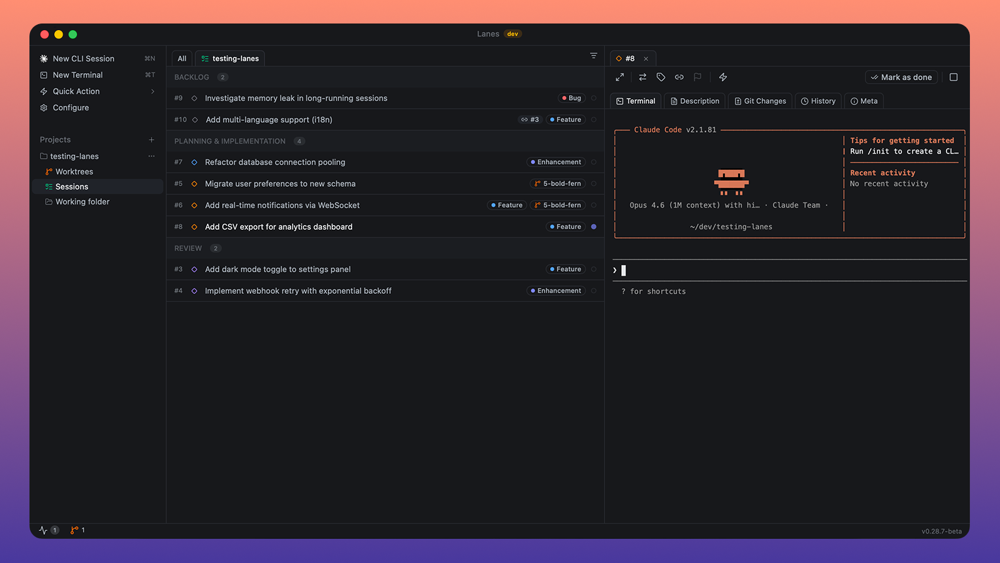

<!--  -->

<p align="center">
  <h1 align="center">Lanes</h1>
  <p align="center"><strong>The agentic development environment.</strong></p>
  <p align="center">Run many AI coding agents in parallel lanes: issues, worktrees, sessions, one board.</p>
  <p align="center">
    <a href="#install">Install</a> ·
    <a href="https://lanes.sh/docs/desktop/quick-start">Quickstart</a> ·
    <a href="https://lanes.sh/docs">Docs</a> ·
    <a href="https://discord.gg/B3f8QjqeBa">Discord</a>
  </p>
</p>

<br>

<p align="center">
  
</p>

<br>

## You lost track three agents ago

Five agents, eight terminal tabs. One is waiting for input. One finished ten minutes ago and nobody noticed. Two are quietly doing the same work. The only thing holding it together is your short-term memory, and it just failed.

Agents got good at writing code. Nothing got good at keeping track of them.

## Lanes is that layer

Lanes is a native macOS app that puts every agent session on an issue board. Each card is a task. Each task can hold live agent terminals, its own git worktree, and the diff those agents produced. You see what is running, what is blocked, what is waiting on you, and what shipped, in one window.

Drag work through your pipeline while your agents execute, then review it without leaving the window: the diff, the editor, the database, the commit, the pull request. No tab archaeology. No lost terminals. No wondering which session was doing what.

## Install

```bash
brew install --cask lanes-sh/lanes/lanes && open -a Lanes
```

Requires macOS Ventura or later. Universal binary, native on Apple Silicon and Intel. Lanes checks for updates on launch and updates itself, and you can check manually under **Settings > General > Updates**.

New here? The **[Quickstart](https://lanes.sh/docs/desktop/quick-start)** takes you from `brew install` to a first agent session.

**Join the [Discord](https://discord.gg/B3f8QjqeBa)** for updates, feedback and questions. We iterate fast, and it is the best place to stay in the loop.

## What you get

### The board

Drag issues through your workflow. The default is Planning, Implementation, Review and Done, plus Backlog and Misc, and the steps are configurable. Multi-select with Shift+Click and Cmd+Click for bulk moves, right-click menus, sorting by newest, recently updated or alphabetical, collapsible columns, and board tabs scoped per project directory and worktree.

Labels come in 13 colors, and you can filter by label, working directory or workflow step. Dependencies link issues with cycle detection, so a dependent card stays blocked until every prerequisite reaches Done. Attachments render image previews inline, and per-repo configuration (labels, CLI flags, quick commands) lives in `.lanes/` next to your code.

### Sessions

Every issue can run agent sessions in real PTY-backed terminals, and an issue can host **several at once**: slots, names and branch-off siblings, so one card holds the plan-mode session and the two implementation runs it spawned.

Start in plan mode or implement mode, choose the model and reasoning effort per session, resume across app restarts, and drag files onto a terminal to inject their paths. Status is read live from what the CLI writes to disk: busy, awaiting input, stopped, exited, error. Each session reports its token usage (input, output, cache created, cache read) and keeps a browsable history of the conversation. Completion sounds tell you when a session wants you, and Keep Awake stops a long run dying to a sleeping laptop.

### Models and harnesses

**Claude Code** and **OpenAI Codex** are first-class: Lanes detects them, reads their state, resumes their sessions and lists their current models. Anything else can run as a plain shell session in the same terminal.

- **[Harness](https://lanes.sh/docs/desktop/harness)** tells you whether the CLI Lanes is about to launch is on your PATH, what version it reports, which package manager installed it, and whether a newer one exists. Updates go through the manager that actually installed it, which matters because a bun or pnpm global install will happily ignore an `npm install -g`.
- **[Gateway](https://lanes.sh/docs/desktop/gateway)** points a session at a model provider of your choosing, with presets for Ollama, LM Studio, vLLM, OpenRouter and z.ai GLM. A profile is applied as real process environment when the session starts, so the request goes straight from the CLI to your provider and Lanes is never in the request path. Research preview.
- **[Local LLMs](https://lanes.sh/docs/desktop/local-llms)** drives Ollama end to end: install, start, stop, pull and remove models, browse the library, and see which models actually fit your RAM before you spend the download. On pull it bakes a context window sized to your machine, because a real session sends roughly 38,000 tokens of harness and tool definitions before you type anything. Research preview.

All three live under **Settings > Agentic Coding**.

### The workbench around them

- **A git client, not just a diff.** The Changes tab has a repository and branch header, a commit box, one button that publishes, pulls or pushes as needed, per-file and full discard, branch switching, and a History tab that can undo the last unpushed commit. Commit, push and open a pull request straight from the issue panel.
- **Worktrees** created per issue with generated branch names, or pick an existing one. Uncommitted and unmerged state in the status bar, auto-cleanup on completion, per-project base branch detection with manual override.
- **A real editor.** Monaco, with a file tree, tabbed editing, dirty tracking, syntax highlighting, markdown preview and save on Cmd+S, plus a Working Folder pane scoped to the project you are on.
- **A database browser** that finds the SQLite files in your project, lists tables and views, and runs read-only SQL. Checking whether a migration did what the agent claimed is two clicks.
- **Git identity switching**, so work in a client repo is not attributed to your personal account, and a clone dialog for starting fresh.
- **A process manager** that discovers running CLI processes system-wide and sorts them into tracked, orphaned and external. Kill one, or stop every session at once.
- **Quick commands** on Cmd+Alt+1 to 9, either injected into the agent session or run as a shell command.
- **Deep links.** `lanes://new?prompt=...` from Linear, GitHub or your own tooling opens a new issue ready to run.

### Your team

Workspaces are local or remote. A remote workspace syncs issues, chat and presence in about two seconds, with member management, per-issue assignees, presence avatars and in-app chat. Reconnects back off gracefully, and a banner tells you when sync is degraded rather than pretending everything is fine.

### Integrations

Connect **GitHub** and **Linear** over OAuth. Browse repos, teams and issues, multi-select import them into Lanes, run them locally, then push the result back as a comment. Agents can drive the same integrations over MCP.

## For agents

Lanes ships a built-in [Model Context Protocol](https://modelcontextprotocol.io) server so Claude Code, Codex and other MCP clients can read your board and drive sessions directly. Enable it under **Settings > Lanes MCP**, then use **Connect Claude Code** or **Connect Codex** for one-click config injection.

| | |
|---|---|
| **Server name** | `lanes-desktop` |
| **Transport** | SSE and Streamable HTTP, on the same URL |
| **Endpoint** | `http://localhost:5353/sse` (port configurable) |
| **Protocol version** | `2024-11-05` |
| **Server version** | `1.0.0` |
| **Tools** | 30: 18 workspace, 6 GitHub, 6 Linear |
| **Auth** | None. Localhost only, and nothing leaves your machine |

<details>
<summary><strong>All 30 tools</strong></summary>

**Issues**

| Tool | Description |
|---|---|
| `lanes_list_issues` | List issues from the board with optional filters (step, tags, componentId, search). |
| `lanes_get_issue` | Get a single issue by numeric ID, including full details and session history. |
| `lanes_create_issue` | Create an issue. Returns it with its assigned ID. |
| `lanes_update_issue` | Patch an issue. Only the fields you supply change. |
| `lanes_delete_issue` | Permanently delete an issue and all its attachments. |
| `lanes_move_issue` | Move an issue to a different board column. |

**Sessions**

| Tool | Description |
|---|---|
| `lanes_start_session` | Start a session for an issue. **Always creates a new one** and never re-attaches, so never call it twice to check whether the first call worked. Handles worktree creation, plan mode, prompt injection, extra flags and env vars. `cli='shell'` gives a plain terminal with no prompt injection. |
| `lanes_stop_session` | Stop a running terminal session. |
| `lanes_resume_session` | Re-attach to a stopped Claude or Codex session, preserving its transcript and slot label. Disambiguate with `session` (UUID, slot or name). |
| `lanes_delete_session` | Stop a session if it is still running, then delete the record. |
| `lanes_get_session_status` | Status for every session, or just one issue's: slot, name, CLI, PID, PTY state, timestamps, runtime status. An empty result right after a start means the launch has not registered yet, not that it failed. |
| `lanes_delete_worktree` | Remove a worktree under `.worktrees/{name}` and, by default, delete its branch. Addressed by project path and worktree name, not by issue ID, and it does not cascade to issues that reference it. |

**History and progress**

| Tool | Description |
|---|---|
| `lanes_get_issue_changes` | Files changed (git diff) in the issue's working directory. The fastest way to review what an agent actually did. |
| `lanes_get_issue_history` | Conversation history for a Claude or Codex session on the issue, paginated. |
| `lanes_read_terminal` | The last N lines of terminal scrollback for a session. Works with any CLI, ANSI codes stripped. |
| `lanes_get_session_stats` | Token usage (input, output, cache), model breakdown, tool call counts and duration for a Claude or Codex session. |

**Metadata**

| Tool | Description |
|---|---|
| `lanes_list_labels` | Every board label (UUID, name, color). Call this before tagging, since tags are UUIDs. |
| `lanes_list_components` | Every project component (UUID, name, project ID). Call this before setting `componentId`. |

**GitHub**, once GitHub is connected in Lanes settings

| Tool | Description |
|---|---|
| `lanes_github_list_repos` | Repos the connected user can access, most recently pushed first. |
| `lanes_github_list_issues` | Open issues in a repo, newest-updated first. PRs filtered out, capped at 50. |
| `lanes_github_search_issues` | Free-text search a repo's open issues. A bare number is treated as an issue number and prepended to the results. |
| `lanes_github_get_issue` | One issue by number, in the canonical `ExternalIssue` shape. |
| `lanes_github_create_issue` | Open a new issue. Labels are GitHub label names, not IDs. |
| `lanes_github_comment_on_issue` | Comment on an issue or a PR. |

**Linear**, once Linear is connected in Lanes settings

| Tool | Description |
|---|---|
| `lanes_linear_list_teams` | Teams the connected user can access. |
| `lanes_linear_list_issues` | Open issues in a team, newest-updated first, capped at 50. |
| `lanes_linear_search_issues` | Search a team's issues by title, description, or issue number. |
| `lanes_linear_get_issue` | One issue by UUID, in the canonical `ExternalIssue` shape. |
| `lanes_linear_create_issue` | Open a new issue in a team. |
| `lanes_linear_comment_on_issue` | Comment on an issue. |

</details>

These descriptions track the server's `tools/list` response, which any MCP client can call against the endpoint for the full JSON schemas. The [Lanes Desktop MCP docs](https://lanes.sh/docs/desktop/local-mcp) cover setup and example prompts, plus the older `lanes-local` and bare `lanes` registrations: both keep working indefinitely, and nothing is renamed unless you ask for it (see [Upgrading From an Older Name](https://lanes.sh/docs/desktop/local-mcp#upgrading-from-an-older-name)).

### Loops

Once an agent can read session status and the diff that came out of it, you can stop prompting and start looping: start work, check it, advance the board, repeat until the goal is met or a human is needed. [Building Loops](https://lanes.sh/docs/desktop/loops) is the practical guide, and [Loop Engineering](https://lanes.sh/blog/loop-engineering-with-lanes) is the thinking behind it.

### Claude Code plugins

This repo doubles as a [Claude Code plugin marketplace](https://code.claude.com/docs/en/plugin-marketplaces). In any Claude Code session:

```
/plugin marketplace add lanes-sh/app
/plugin install lanes-desktop@lanes   # the issue board and its MCP
/plugin install lanes-forms@lanes     # Lanes Forms
/lanes:setup-mcp                      # desktop only: register the MCP
```

Install whichever you need. Update with `/plugin marketplace update lanes`. If you installed the old single `lanes` plugin before it was split, install `lanes-desktop@lanes` instead; the old name still resolves, so existing installs keep updating either way.

**[`lanes-desktop`](plugins/lanes-desktop)** drives the board from chat:

- **[`lanes-sessions`](plugins/lanes-desktop/skills/lanes-sessions/SKILL.md)** teaches the `lanes_*` tools and the multi-session model: creating issues, starting and inspecting sessions, batch-launching across worktrees, reading terminal output, resolving labels and components.
- **[`github-lanes-bridge`](plugins/lanes-desktop/skills/github-lanes-bridge/SKILL.md)** and **[`linear-lanes-bridge`](plugins/lanes-desktop/skills/linear-lanes-bridge/SKILL.md)** move work in and out: import a ticket or a whole sprint, decompose it into sub-issues with dependencies, then push PR links and comments back.
- **`/lanes:setup-mcp`** connects Claude Code and Cursor to the running app and verifies the endpoint is live.

**[`lanes-forms`](plugins/lanes-forms/skills/lanes-forms/SKILL.md)** is separate from the desktop app: provision a live [Lanes Forms](https://lanes.sh/forms) endpoint with one POST and no signup, or fill in a form on someone's behalf.

Prefer [skills.sh](https://skills.sh)? `npx skills add lanes-sh/app` installs the SKILL.md files only. Register the MCP yourself with:

```
claude mcp add --transport sse lanes-desktop http://localhost:5353/sse --scope user
```

then restart Claude Code. Lanes has to be running for the endpoint to answer.

## Keyboard shortcuts

| Shortcut | Action |
|---|---|
| Cmd+N | New backlog issue |
| Cmd+T | New Misc task |
| Cmd+R | Move selected issue(s) to Review |
| Cmd+D | Complete selected issue(s) |
| Cmd+E | Remove selected issue(s) |
| Cmd+, | Open Settings |
| Cmd+S | Save file in editor |
| Cmd+A | Select all in column, then all issues |
| Cmd+Alt+1-9 | Run quick command by position |
| Ctrl+Tab | Cycle panel tabs (add Shift to go back) |
| Shift+Click | Range select issues |
| Cmd/Ctrl+Click | Toggle individual issue selection |
| Cmd+Enter | Confirm the open dialog |
| Escape | Clear selection or close dialog |

## Documentation

- **[Quickstart](https://lanes.sh/docs/desktop/quick-start)** goes from install to a running agent session.
- **[Desktop docs](https://lanes.sh/docs/desktop)** cover everything above in detail, including [the issue board](https://lanes.sh/docs/desktop/issue-board), [sessions](https://lanes.sh/docs/desktop/sessions), [worktrees](https://lanes.sh/docs/desktop/worktrees), [git integration](https://lanes.sh/docs/desktop/git-integration), [keyboard shortcuts](https://lanes.sh/docs/desktop/keyboard-shortcuts) and [settings](https://lanes.sh/docs/desktop/settings).
- **[All Lanes docs](https://lanes.sh/docs)**, where [/docs/mcp](https://lanes.sh/docs/mcp) compares the three MCP servers we ship.

## Part of Lanes

Lanes is a family of products for building with agents. [Overview](https://lanes.sh/overview).

- **[Lanes Desktop](https://lanes.sh/desktop)** is this repo: mission control for your agent sessions, on your Mac.
- **[Lanes Link](https://lanes.sh/link)** is one MCP endpoint you run yourself, sitting between your agents and your accounts, memory, skills and secrets. Connect Gmail, Drive, Notion, Linear, GitHub, Slack and around twenty others once, keep work and personal profiles apart, and decide per capability what each agent may do. Deny by default, enforced at dispatch rather than asked of the model, with an append-only audit log. Free and open source: [github.com/lanes-sh/link](https://github.com/lanes-sh/link).
- **[Lanes Forms](https://lanes.sh/forms)** gives you a live form endpoint from a single POST, with no signup. Submissions are captured from the first second, forwarded by email or webhook, and the form can be claimed into a dashboard later.
- **[Lanes Compute](https://lanes.sh/compute)** is GPUs on demand, from a single A100 to multi-node H100 clusters over InfiniBand, billed per second. In limited early access, so request access on the page.
- **[Managed Services](https://lanes.sh/services)** is our team building and operating it for you, with humans accountable for the result.

## Under the hood

Tauri 2, React 19, Rust and SQLite. Axum serves the MCP, `portable-pty` runs the terminals, xterm.js renders them, Monaco edits your files. Fast startup, low memory, native performance.

Local-first by default: a local workspace keeps every issue, session and setting in SQLite on your machine, and your code never goes anywhere. Remote workspaces are opt-in and sync issues, chat and presence through our backend so a team can share a board. Crash reporting is opt-in too.

## License

Proprietary. All rights reserved.
